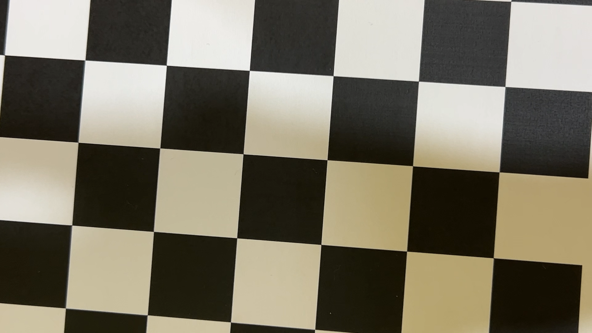
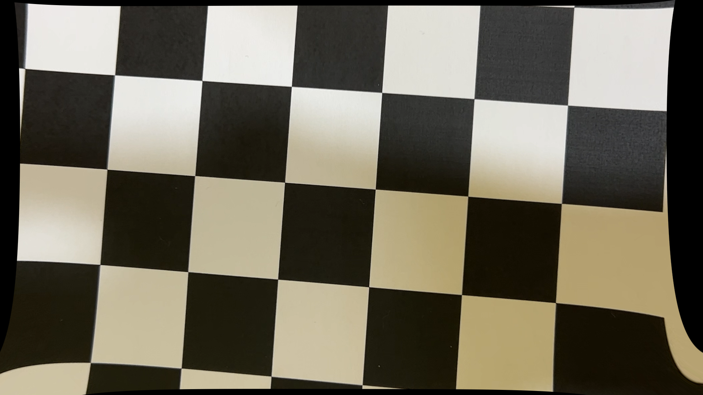

# Vision_Unwrapper

카메라 캘리브레이션 및 렌즈 왜곡 보정 프로젝트입니다.

---

## 📁 파일 구조

| 파일 | 설명 |
|---|---|
| `camera_calibration.py` | 체스보드 영상으로 카메라 내부 파라미터 캘리브레이션 |
| `distortion_correction.py` | 캘리브레이션 결과를 이용한 실시간 렌즈 왜곡 보정 |
| `pose_estimation.py` | 체스보드 기반 카메라 포즈(R, t) 추정 및 시각화 |
| `calib_result.npz` | 캘리브레이션 결과 저장 파일 (Camera Matrix, Distortion Coefficients) |

---

## 🔧 캘리브레이션 결과 (Calibration Result)

> 체스보드 패턴: **10 × 7**  /  셀 크기: **25.0 mm**

### Camera Matrix (K)

$$
K = \begin{bmatrix}
f_x & 0 & c_x \\
0 & f_y & c_y \\
0 & 0 & 1
\end{bmatrix}
= \begin{bmatrix}
2348.78 & 0 & 948.12 \\
0 & 2276.76 & 412.05 \\
0 & 0 & 1
\end{bmatrix}
$$

| 파라미터 | 값 |
|---|---|
| $f_x$ (focal length X) | 2348.78 px |
| $f_y$ (focal length Y) | 2276.76 px |
| $c_x$ (principal point X) | 948.12 px |
| $c_y$ (principal point Y) | 412.05 px |

### Distortion Coefficients

$$
[k_1,\ k_2,\ p_1,\ p_2,\ k_3]
= [-0.0970,\ 2.0321,\ -0.00448,\ -0.00225,\ -10.9551]
$$

| 파라미터 | 값 |
|---|---|
| $k_1$ | -0.09704 |
| $k_2$ | 2.03214 |
| $p_1$ | -0.00448 |
| $p_2$ | -0.00225 |
| $k_3$ | -10.95511 |

---

## 🖼️ 왜곡 보정 결과 (Distortion Correction Result)

아래 이미지는 `distortion_correction.py` 실행 후 캡처된 결과입니다.

| Original (Distorted) | Corrected (Undistorted) |
|:---:|:---:|
|  |  |

- **왼쪽**: 렌즈 왜곡이 포함된 원본 영상
- **오른쪽**: 캘리브레이션 파라미터로 왜곡을 보정한 영상

---

## ▶️ 실행 방법

```bash
# 1. 카메라 캘리브레이션 (calib_result.npz 생성)
python3 camera_calibration.py

# 2. 렌즈 왜곡 보정 (실시간 비교 + 종료 시 이미지 저장)
python3 distortion_correction.py

# 3. 포즈 추정
python3 pose_estimation.py
```